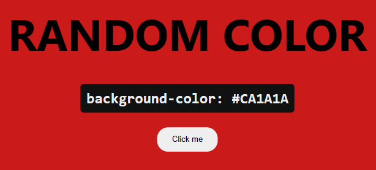

# Random Color

Random color is a web application where you find hexadecimal random colors. You don't need to install anything, just open in your lovely browser.

_For contribute, just submit your pull request_
